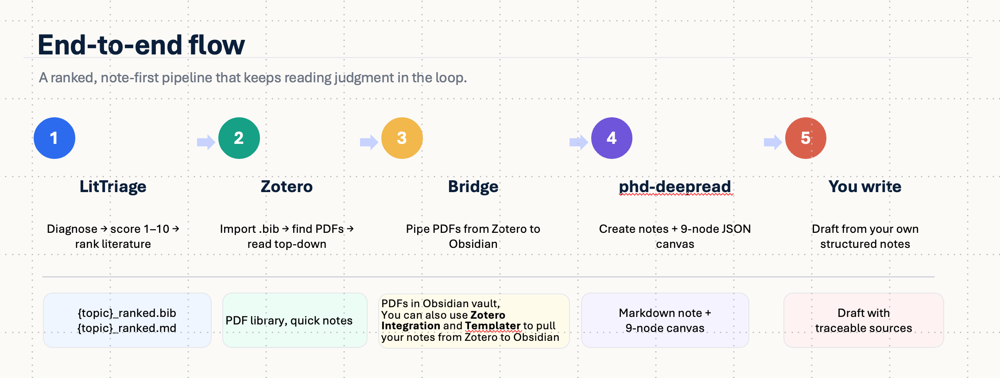

# LitTriage / 文献分诊

[](https://opensource.org/licenses/MIT)
[](https://www.python.org/downloads/)
[](https://claude.com/claude-code)
[](#quick-start)
[](README.zh-CN.md)

> **Diagnose** your literature, **rank** it, and read what you most need to read **first**.
> 像分诊病人一样分诊文献：先诊断 → 再排序 → 先读最重要、最贴近你需求的那几篇。

> [!IMPORTANT]
> **You will never read every paper — and you were never meant to.**
>
> The real skill is judgment: *what to read first.* And that judgment isn't
> universal. What makes a paper matter most in *your* field is something only you
> can name — the assay, the model system, the clinical stage, the dataset.
> LitTriage turns that judgment into a scoring algorithm **you design**, then ranks
> your literature by it. So on day one you open the paper that matters — not page 7
> of PubMed.
>
> It's a tool you use — and a ranking algorithm you make your own.

---

A bite-sized Claude Code / Codex **skill** that **searches and triages**
medical literature: it plans MeSH-aware PubMed queries, retrieves and
de-duplicates papers, scores each one 1–10 for relevance, tags its study type
and evidence level, and emits a **ranked, score-tagged BibTeX** plus a
**triage table**.

It is the **first step** of a larger reading-and-writing workflow ↓

---

## Your academic workflow for literature reading & writing

LitTriage is the entry point. Each stage below is its own tool/skill — chain
them, or stop wherever you have what you need.

<p align="center">
  
</p>

<details>
<summary>📋 Text version of the workflow</summary>

```
①  LitTriage · this repo  —  Search + Triage
       diagnose -> score 1-10 -> rank your literature
       outputs: {topic}_ranked.bib (scores as tags) · {topic}_ranked.md (triage table)
   |
   v
②  Zotero  —  Collect + Read
       import the .bib -> "Find Available PDF" -> read top-down by score
       jot quick literature notes as you go
   |
   v
③  zotero-deepread-bridge  —  Export to Obsidian
       pipes the PDFs from Zotero straight into your Obsidian vault.
       Or, in Obsidian, use Zotero Integration + Templater to export your
       notes and highlights along with the PDFs.
   |
   v
④  phd-deepread  —  Deep-read + Visualize
       per paper: a markdown literature note + a 9-node JSON canvas
   |
   v
✍️  You write — grounded in notes you actually made, not an abstract-only summary.
```

</details>

**Where you can branch / customize:**

- **Stop at ②** if you only need a ranked reading list — that's a complete,
  useful outcome on its own.
- **Steps ③–④ are optional**, for when a paper is important enough to deserve
  structured notes and a visual concept map.
- **Swap in your own reader** at ②: any reference manager that imports BibTeX
  works; the score tags just won't auto-sort as neatly as in Zotero.
- **Re-run ①** with a refined topic anytime — new hits land in the same Zotero
  collection with fresh score tags.

---

## What LitTriage gives you

Two deliverables, then it gets out of the way:

| File | What it is | What you do with it |
| :--- | :--- | :--- |
| `{topic}_ranked.rdf` | Zotero RDF: a parent collection with **one subcollection per theme** (reviews first), papers already filed inside. | Import once → real theme **subfolders** in Zotero. |
| `{topic}_ranked.bib` | DOI-keyed BibTeX in theme order. Each entry's `keywords` carry `score-08, topic-…, type-rct, evidence-2, litriage`. | Import to Zotero for a flat collection — the keywords become **sortable tags**, so you read by `score-09 → score-08 → …`. |
| `{topic}_ranked.md` | A triage note: a "How this was built" provenance funnel + score/evidence snapshot, then papers **grouped by subtopic** (reviews/meta-analyses first, then by best score) — score · evidence · year · first author · title · journal · DOI. | Eyeball it first to decide what's worth pulling the PDF for. |

**It does not write the review for you** — and that's the point. You (or your
students) read the real manuscripts, ranked best-first, instead of trusting an
abstract-only auto-summary.

---
## Quick start
```bash
# Install into your Claude Code skills directory
git clone https://github.com/heleninsights-dot/LitTriage.git ~/.claude/skills/litriage
```

Then, inside Claude Code / Codex, just ask:

```
litriage: search the literature on tPBM for Alzheimer's-related MCI
用 litriage 帮我检索 tPBM 在阿尔茨海默病中的应用
```

Or run the stages directly:
```bash
python3 scripts/pubmed_search.py --queries .litriage/queries.json --out .litriage/papers_pubmed.jsonl
python3 scripts/dedupe.py        --in .litriage/papers_pubmed.jsonl --out .litriage/candidates.jsonl
# (the AI scores candidates -> .litriage/scored_papers.jsonl)
python3 scripts/build_outputs.py --scored .litriage/scored_papers.jsonl --topic "my topic" \
    --out-bib my-topic_ranked.bib --out-md my-topic_ranked.md --out-rdf my-topic_ranked.rdf
```

**Requirements:** Python 3.9+. That's it — no `pip install`, no LaTeX, no pandoc.

---
## Why this workflow is nice

- **Read what matters first.** Triage scoring means a PhD student opens the most
  relevant, highest-evidence papers on day one — not page 7 of PubMed results.
- **Evidence-aware.** Every paper is tagged `type-rct`, `evidence-2`, etc., so
  the workflow teaches the evidence hierarchy while you sort.
- **The score follows the paper.** BibTeX `keywords` import as Zotero tags
  (`score-08`, zero-padded so it sorts), so your triage survives all the way
  into your reading list.
- **End-to-end, but modular.** One coherent path from "I have a topic" to "I have
  organized notes and a concept map" — yet every step is optional and swappable.
- **Zero dependencies.** Python 3.9+ stdlib only. Trivial to install, easy to
  share, nothing to break.

---

> **Design note — make the scoring your own.** Here's the idea worth borrowing,
> whatever your field: the *bones* of a good ranking algorithm carry across every
> discipline — but the *dimensions* you rank on are yours to choose. LitTriage
> happens to score on clinical evidence, yet that's only one recipe. In
> translational science, for example, you'd put **assay technology** under
> "method," give **model system** its own axis, and let **clinical maturity raise
> the score** — a biomarker already in the clinic shouldn't lose to one that has
> only ever lived in a dish. Every field has its own quiet sense of *"what makes a
> paper worth reading first"*; name those few axes, and the same machinery ranks
> your literature your way.
> See [`references/02_scoring_translational.md`](references/02_scoring_translational.md) for a worked example you can copy and adapt.
>
> 🎓 **If you want to design the scoring algorithm for your own research field, start right here.**

---

## How LitTriage works (under the hood)
```
topic
  ① MeSH-aware query planning            (AI → queries.json)
  ② PubMed retrieval (OpenAlex fallback) (pubmed_search.py)
  ③ de-duplication                       (dedupe.py)
  ④ score 1-10 + study-type tag          (AI → scored_papers.jsonl)
  ⑤ build deliverables                   (build_outputs.py)
        ↓
  {topic}_ranked.rdf   +   {topic}_ranked.bib   +   {topic}_ranked.md
```

See `SKILL.md` for the full stage-by-stage contract and `references/` for the
query-planning and scoring prompts.

---
## Acknowledgments
The core **search → de-duplicate → 1–10 relevance score → high-score-first
selection** *concept* (stages 1–4) is **inspired by** the excellent
[`ChineseResearchLaTeX`](https://github.com/huangwb8/ChineseResearchLaTeX) skill by **Bensz Conan ([@huangwb8](https://github.com/huangwb8))**.

This is an **independent reimplementation** — no source files were copied. The
PubMed-first retrieval, MeSH/study-type/evidence tagging, the score-into-Zotero
handoff, and the deliberate "no writing stage" design are original to LitTriage. In short, LitTriage shares only the stage 1–4 scoring idea; the retrieval source, tagging, Zotero/Obsidian handoff, and overall workflow are entirely its own.

## License

MIT — see [LICENSE](LICENSE).
